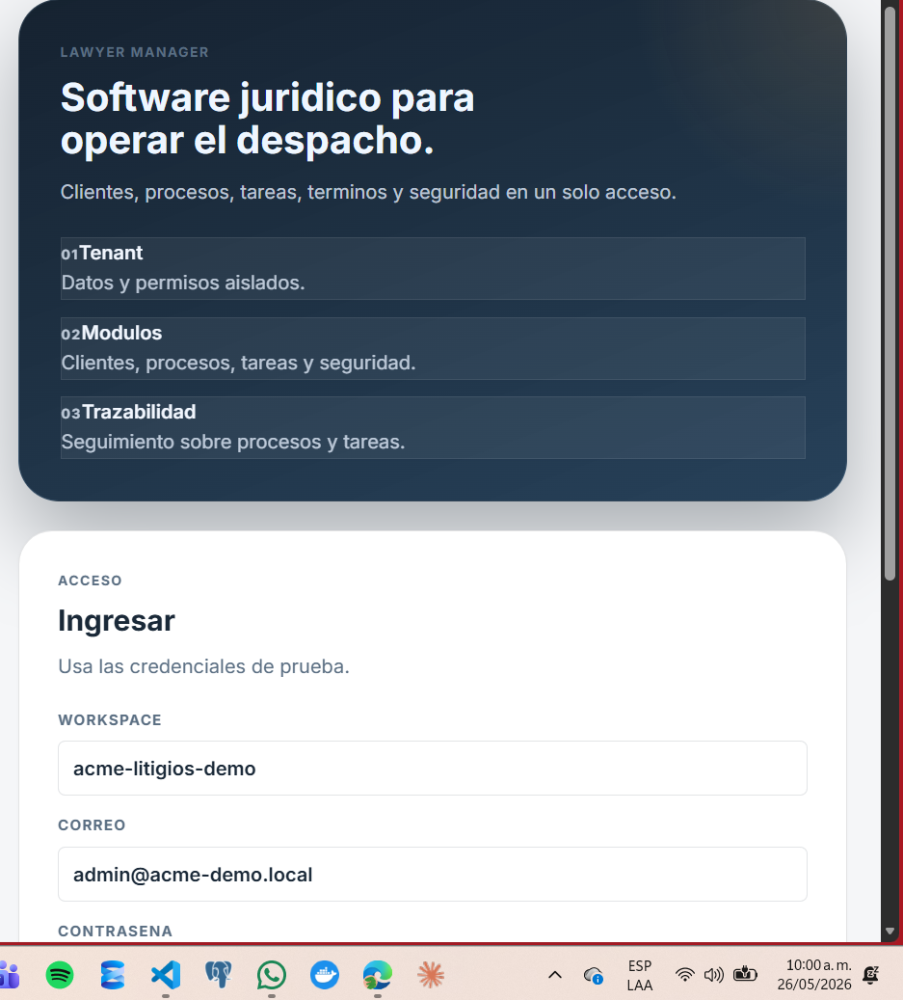
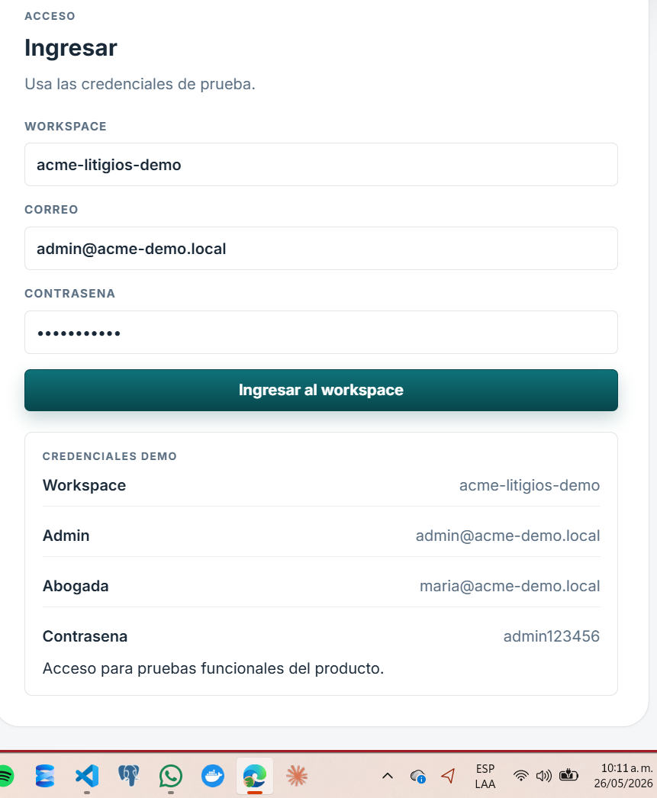
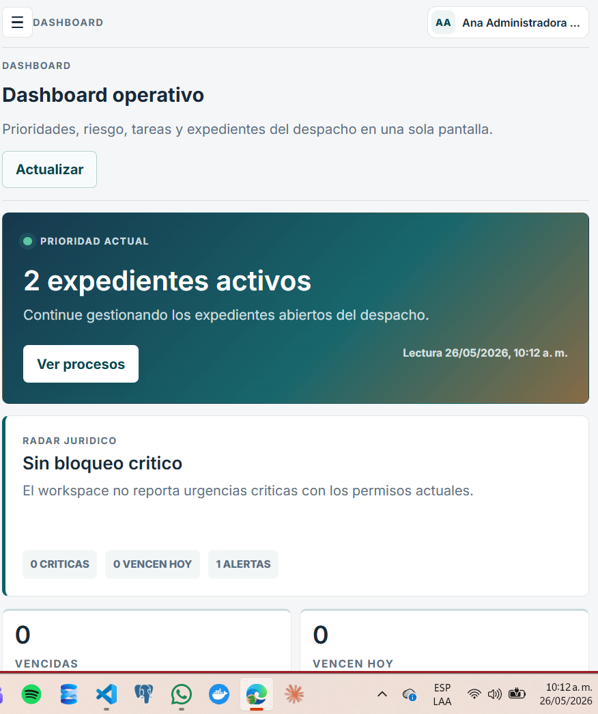
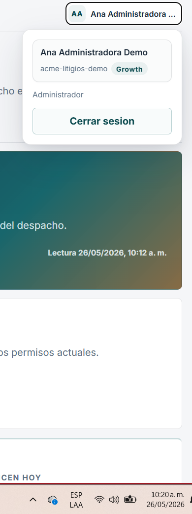
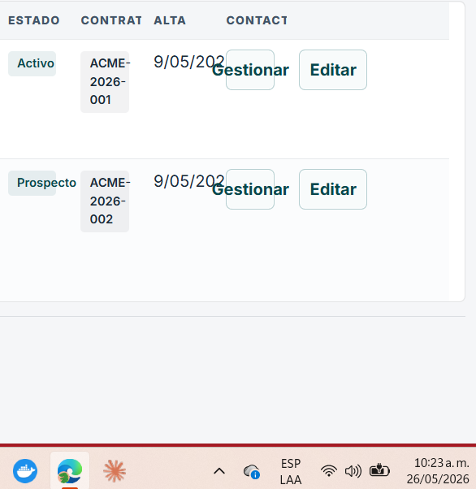
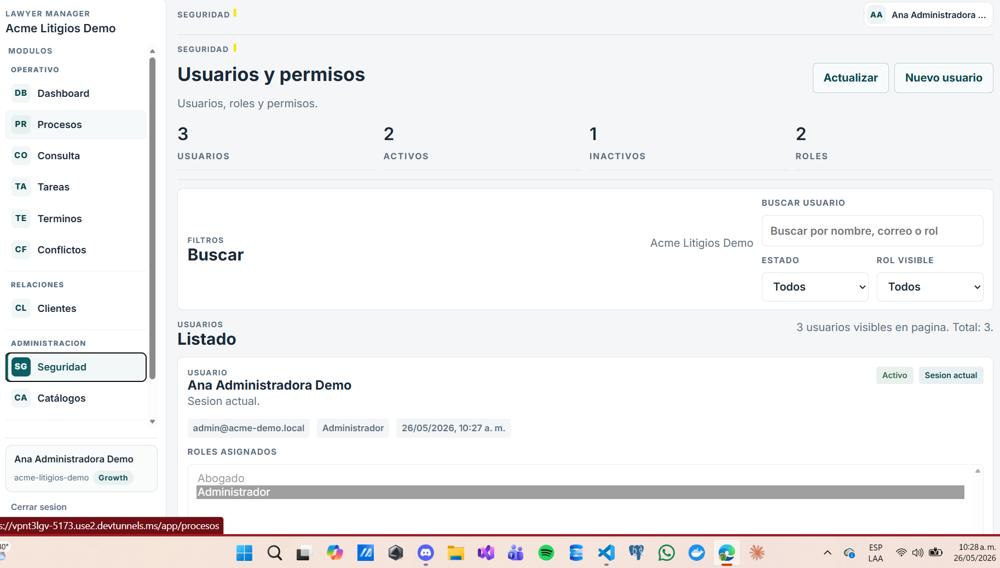
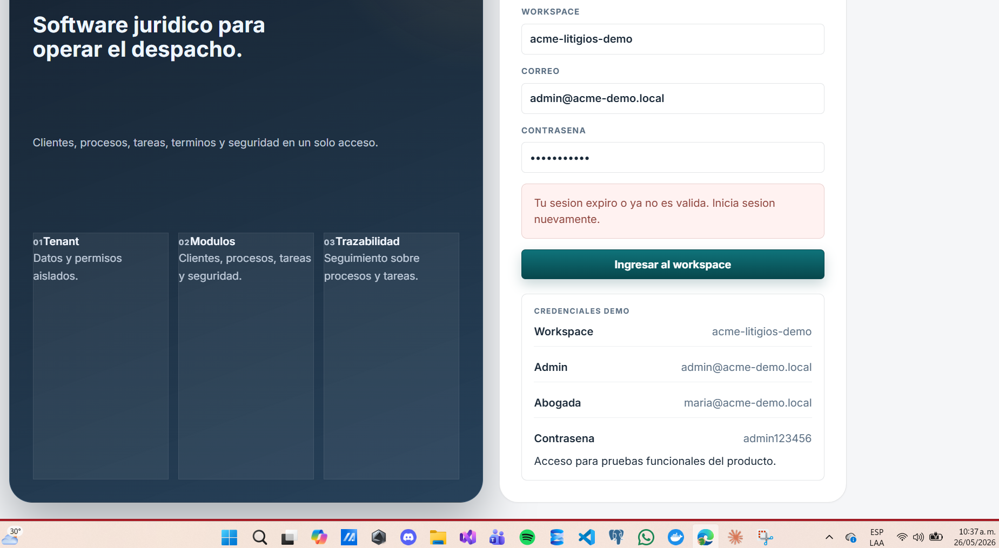
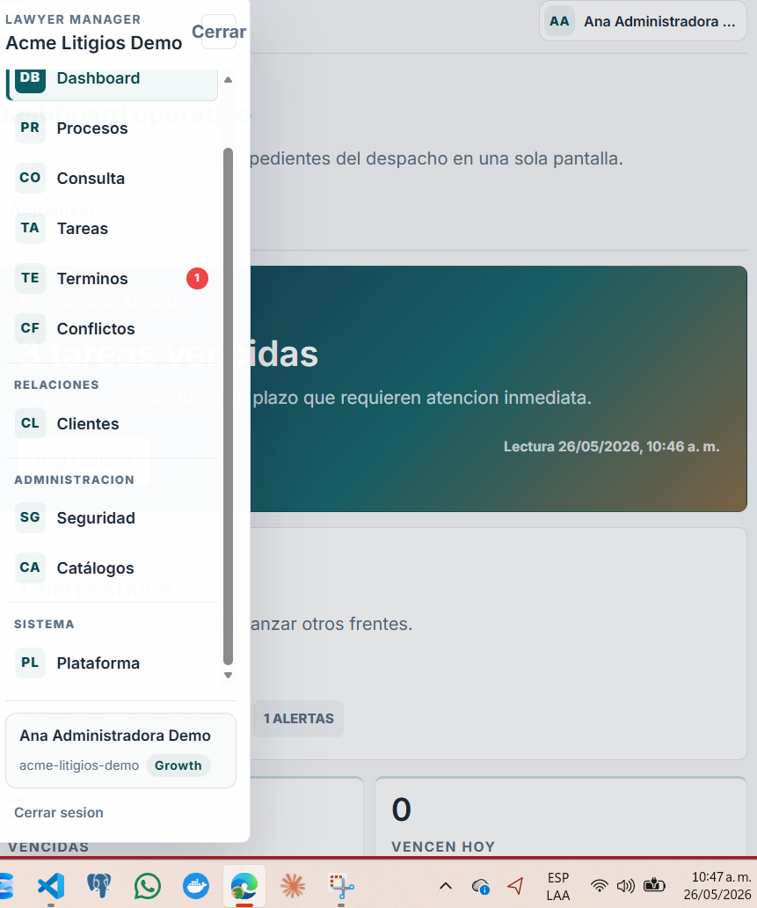
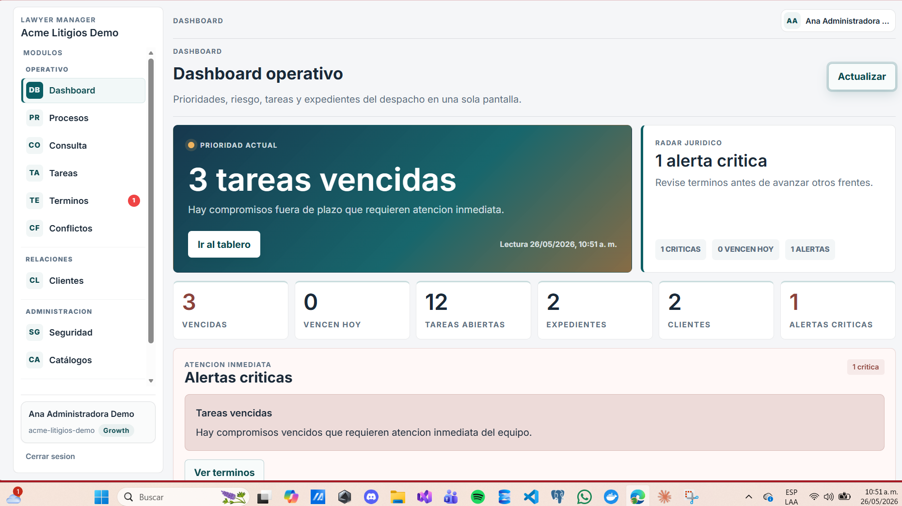
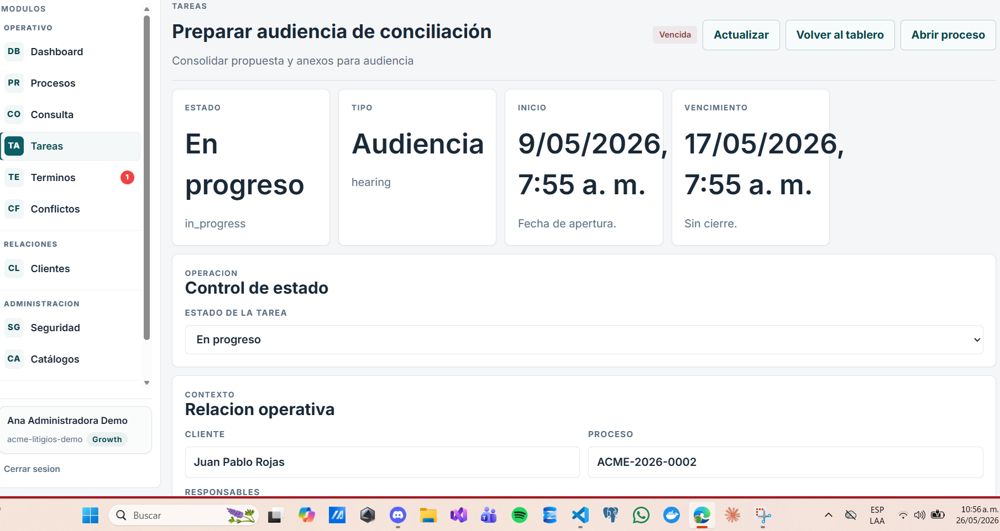

Descripción técnica del problema visual:
Los números (01, 02, 03) aparecen:
demasiado pequeños,
y pegados al texto principal (“Tenant”, “Modulos”, “Trazabilidad”).

Se presenta un error de maquetación/alineación en los encabezados de las tarjetas del formulario. Los indicadores numéricos (01, 02, 03) no están correctamente alineados con los títulos principales, generando inconsistencia visual y afectando la legibilidad de la interfaz.

se presenta un error de consistencia visual en la interfaz debido al uso excesivo de mayúsculas sostenidas en títulos, etiquetas y encabezados del formulario. Esta práctica reduce la legibilidad, dificulta la jerarquía visual de los elementos y genera una apariencia rígida y poco moderna en la experiencia de usuario. Además, provoca que múltiples componentes compitan visualmente por atención, afectando la claridad y escaneabilidad de la información.

Se presenta un problema de espaciado y alineación en el encabezado superior del dashboard, debido a que el título “Dashboard” se encuentra demasiado cercano al icono del menú lateral. Esta proximidad genera una percepción visual de saturación y afecta la claridad y organización de los elementos en la barra superior de navegación.

Se presenta un error ortográfico en el menú de usuario del dashboard, debido a que el texto “Cerrar sesion” no contiene la tilde correspondiente en la palabra “sesión”. Esta inconsistencia afecta la calidad visual de la interfaz y reduce la percepción de profesionalismo y cuidado en la experiencia de usuario.

Se presenta un problema de maquetación y desbordamiento visual en la tabla de registros, debido a que el tamaño de la tipografía y los componentes de acción exceden el espacio disponible dentro de las columnas. Esto provoca que textos y botones se superpongan entre sí, afectando la legibilidad, alineación y correcta visualización de la información en la interfaz.

Se presenta una duplicidad visual en el encabezado de la sección de seguridad, debido a que el título “SEGURIDAD” aparece repetido en la parte superior de la interfaz. Esta redundancia genera ruido visual, afecta la jerarquía de navegación y puede causar confusión en la organización de los contenidos dentro del módulo.

Se presenta un problema de distribución y aprovechamiento del espacio en la interfaz de inicio de sesión, debido a que la sección lateral izquierda contiene amplias áreas vacías y elementos con dimensiones desproporcionadas. Esta situación genera una sensación de desequilibrio visual, afecta la organización del contenido y disminuye la percepción de optimización y profesionalismo de la interfaz.

Se presenta un problema de alineación y distribución del contenido en el menú lateral de la plataforma, específicamente en la parte superior donde se ubica la opción “Cerrar”. El texto excede los límites visuales del contenedor, provocando un desbordamiento que afecta la estética y consistencia de la interfaz. Esta situación genera una percepción de desorden visual, reduce la claridad de navegación y afecta la presentación profesional del sistema.

Se presenta un problema de funcionalidad en el botón “Actualizar” ubicado en la parte superior derecha del dashboard, debido a que no ejecuta ninguna acción al ser seleccionado por el usuario. Esta situación afecta la interacción esperada dentro de la interfaz, genera incertidumbre sobre el estado de actualización de la información y disminuye la percepción de confiabilidad y usabilidad del sistema.

Se presenta un problema de visualización y ajuste tipográfico en el módulo de tareas, debido a que el contenido textual excede los límites establecidos dentro de las tarjetas informativas. Esta situación provoca que las letras y fechas se sobresalgan del contenedor, afectando la alineación, legibilidad y equilibrio visual de la interfaz. Como consecuencia, se reduce la claridad de la información mostrada y la percepción de orden y profesionalismo del sistema.
